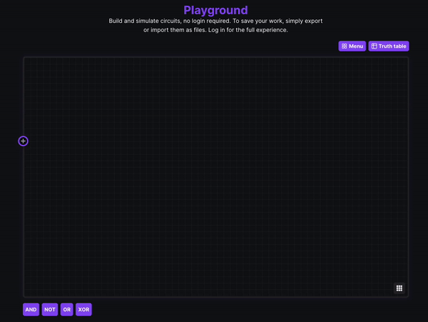

Logic Gates is a web app for building, simulating and sharing circuits.

The [main branch](https://github.com/alexwith/logic-gates/tree/main) contains a full social network in addition to the simulation and editing environment. This branch is no longer hosted as it didn't really have any use case, and was more a project for learning kotlin on the backend. The [learning-edition branch](https://github.com/alexwith/logic-gates/tree/learning-edition), a no-login simulator and editor,
is hosted and can be found at [logicgates.alexwith.com](https://logicgates.alexwith.com/)

## License
Logic Gates is free and open source software. The software is released under the terms of the [GPL-3.0 license](https://github.com/alexwith/logic-gates/blob/main/LICENSE).
