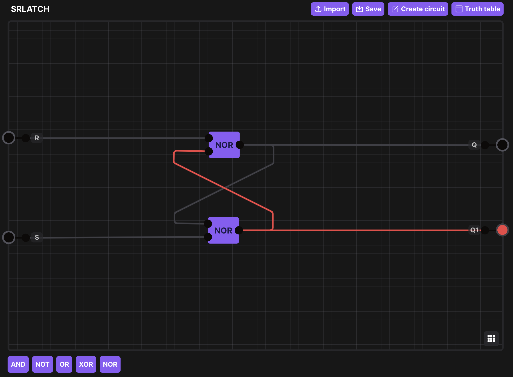

# ⛩️ Logic Gates
Logic Gates is a web app to simulate and build circuits.

## License
Logic Gates is free and open source software. The software is released under the terms of the [GPL-3.0 license]("https://github.com/alexwith/logic-gates/blob/main/LICENSE").